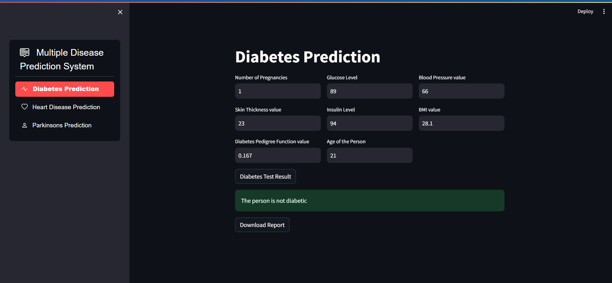
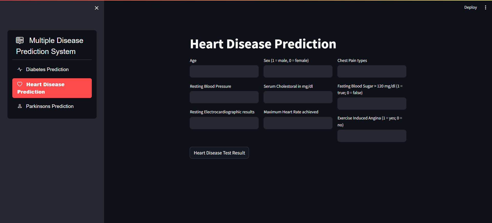
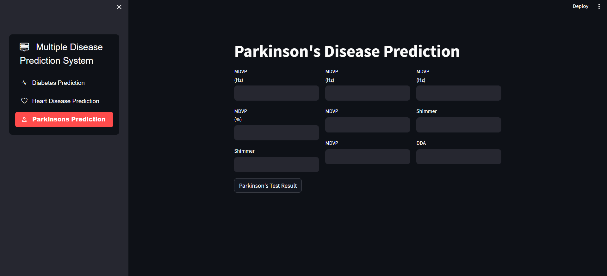
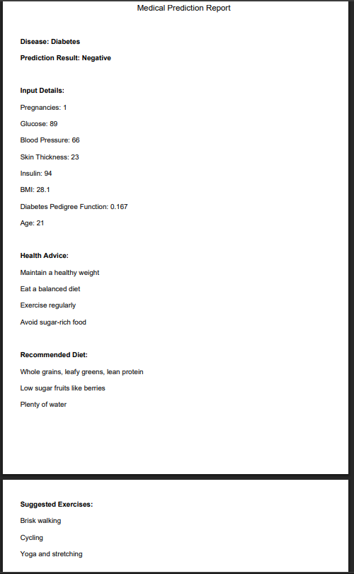

# Multiple-disease-prediction
A Streamlit-based ML web app that predicts Diabetes, Heart Disease, and Parkinson’s Disease using SVM &amp; Logistic Regression. Features a dark-themed interface, sidebar navigation, and personalized PDF medical reports. Built with Python, scikit-learn, Streamlit &amp; fpdf for speed, accuracy, and usability.

A professional-grade Streamlit web application that predicts the likelihood of three major health conditions using trained ML models:

🩺 Diabetes (SVM Classifier)
❤️ Heart Disease (Logistic Regression)
🧠 Parkinson’s Disease (SVM Classifier)
Built for simplicity, speed, and usability, this tool is perfect for healthcare demos, academic projects, and early screening support.

---

## 🚀 Features
✅ User-friendly Streamlit interface with sidebar navigation
📄 PDF medical report export with personalized health advice
🌙 Clean dark-themed interface
⚙️ Fast prediction using trained .sav models

---

## 🧬 Technologies Used  

| Tech Stack   | Description                     |
|--------------|---------------------------------|
| **Python**   | Core programming language       |
| **Streamlit**| Frontend web framework          |
| **scikit-learn** | Model training & predictions |
| **fpdf**     | Lightweight PDF generation      |

---

## 📸 Screenshots

---

## 📂 Project Structure
main.py # Streamlit app
diabetes_model.sav # Trained SVM model
heart_model.sav # Trained Logistic Regression model
parkinsons_model.sav # Trained SVM model
Screenshots/ # App UI screenshots
├── Screenshot 2025-07-25 204932.png
├── Screenshot 2025-07-25 204938.png
├── Screenshot 2025-07-25 205224.png
└── Screenshot 2025-07-25 210636.png
requirements.txt # Dependencies
README.md # Project documentation
